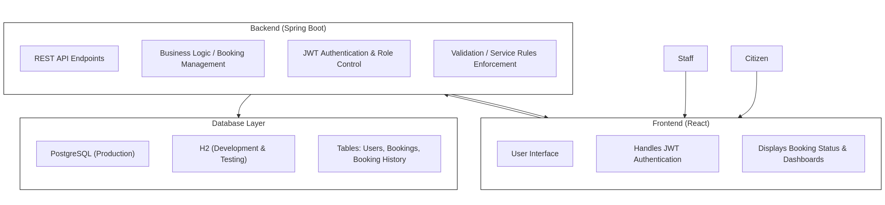
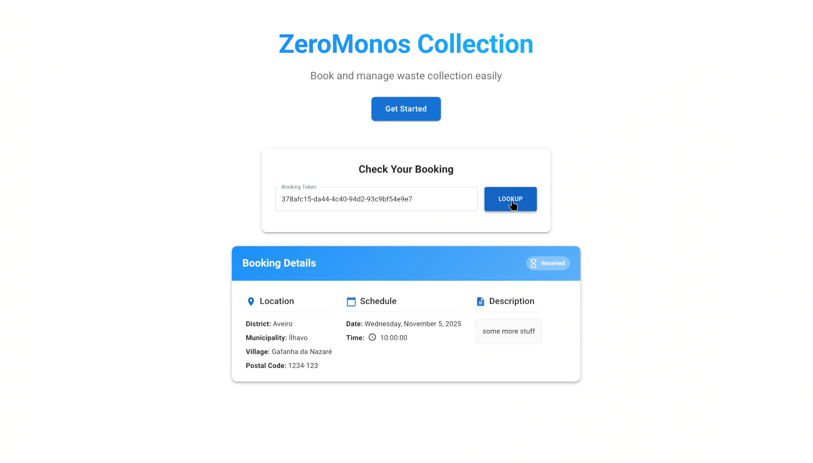
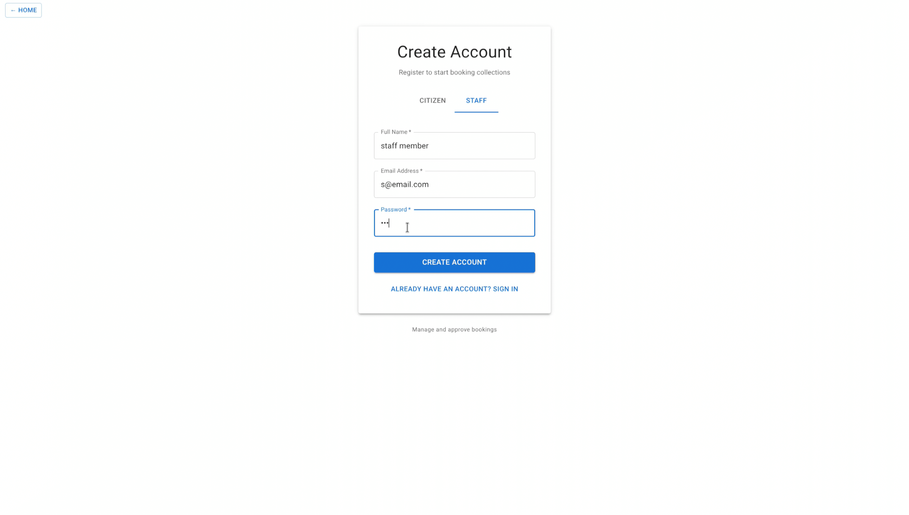
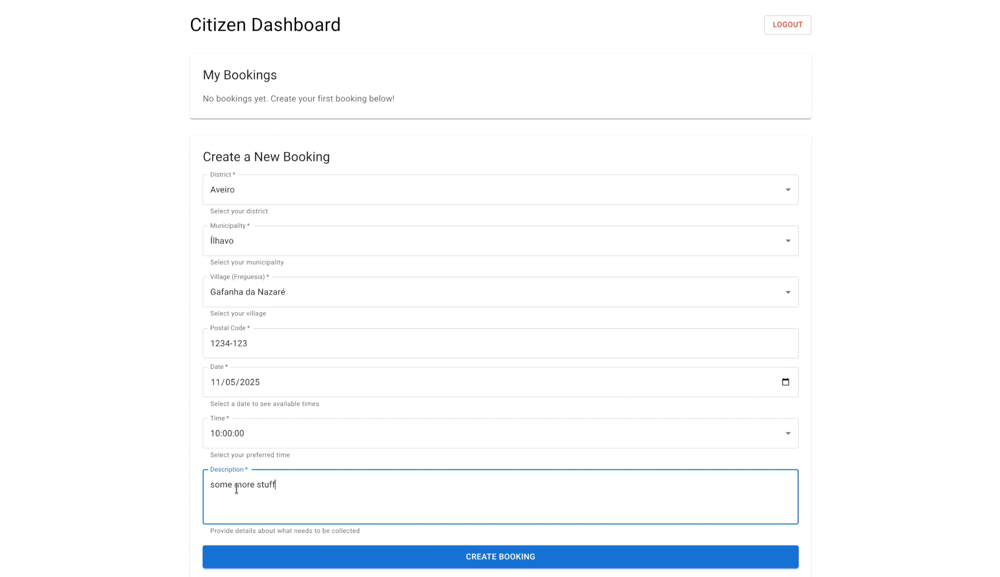
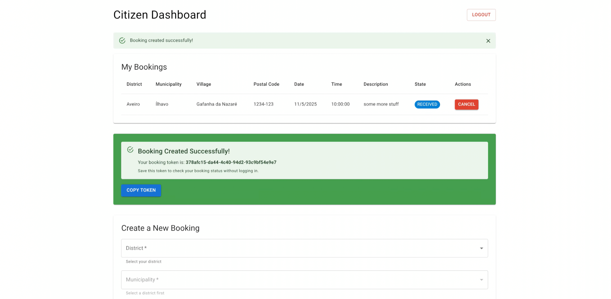
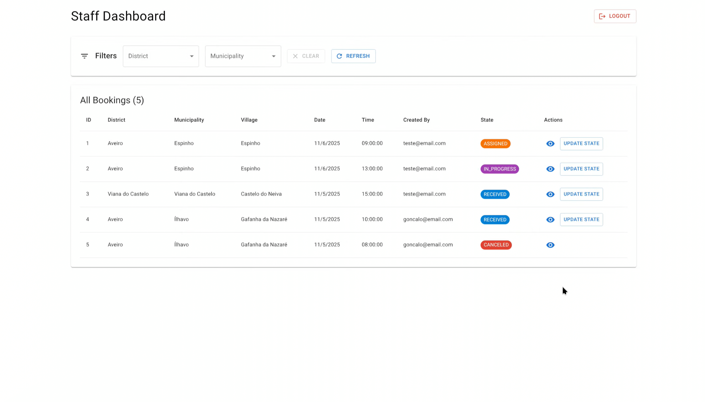
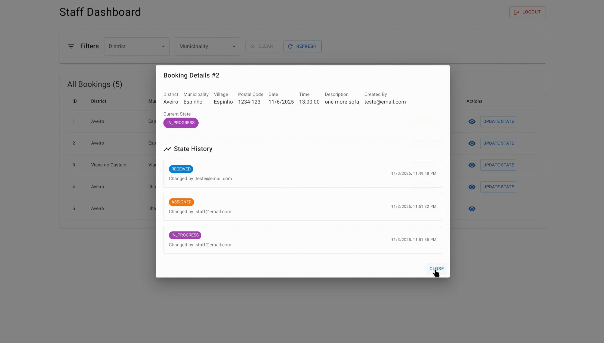

# ZeroMonos - Bulky Waste Collection Platform

**ZeroMonos** is a full-stack web application developed as part of the **Teste e Qualidade de Software (TQS)** course at the **University of Aveiro**.

It provides digital tools for citizens and municipal staff to manage bulky waste collection requests across multiple municipalities.

## Overview

ZeroMonos streamlines bulky waste collection by allowing citizens to:

- Submit pickup requests for large waste items (e.g., furniture, appliances).
- Track the status of their requests.
- Cancel requests when necessary.

Meanwhile, staff members can:

- View and manage all incoming requests.
- Filter bookings by municipality or district.
- Update booking statuses (received, assigned, in progress, done, canceled)

Authentication is handled via **JWT** with **role-based access control**, ensuring distinct functionalities for each user type.

## Simple Architecture Overview

The system follows a clean **frontend-backend separation**:



## Technologies Used

| Layer        | Stack                           |
| ------------ | ------------------------------- |
| **Frontend** | React.js, Vite, Material UI     |
| **Backend**  | Spring Boot, Maven              |
| **Database** | PostgreSQL (H2 for dev/testing) |
| **Security** | JWT-based Authentication        |
| **CI/CD**    | GitHub Actions                  |
| **QA Tools** | SonarQube, Lighthouse           |

## API

| **Endpoint**                                       | **Access Level** | **Description**                                   |
| -------------------------------------------------- | ---------------- | ------------------------------------------------- |
| `POST /api/v1/auth/register`                       | Public           | Register a new user                               |
| `POST /api/v1/auth/login`                          | Public           | Authenticate and obtain a JWT token               |
| `GET /api/v1/bookings/public/{token}`              | Public           | Retrieve public booking information using a token |
| `POST /api/v1/bookings`                            | Citizen-only     | Create a new bulky waste collection booking       |
| `GET /api/v1/bookings/me`                          | Citizen-only     | View bookings made by the authenticated citizen   |
| `DELETE /api/v1/bookings/{id}`                     | Citizen-only     | Cancel an existing booking                        |
| `GET /api/v1/bookings`                             | Staff-only       | Retrieve all bookings for staff management        |
| `PUT /api/v1/bookings/{id}/state`                  | Staff-only       | Update the state of a booking                     |
| `GET /api/v1/bookings/municipality/{municipality}` | Staff-only       | View bookings filtered by municipality            |
| `GET /api/v1/bookings/district/{district}`         | Staff-only       | View bookings filtered by district                |
| `GET /api/v1/bookings/{id}`                        | Citizen or Staff | Retrieve a booking by its ID                      |
| `GET /api/v1/bookings/{id}/history`                | Citizen or Staff | View booking state change history                 |
| `GET /api/v1/bookings/available-times`             | Citizen or Staff | Retrieve available time slots for bookings        |

## Running the Project

```bash
git clone git@github.com:goncalooliveirasilva/ua-tqs-zeromonos.git
```

### Backend

```bash
cd zeromonos-collection
mvn spring-boot:run
```

### Frontend

```bash
cd frontend
npm install
npm run dev
```

## Documentation

The full documentation and analysis of this project can be found in [report.pdf](./docs/report.pdf).

## Screenshots












